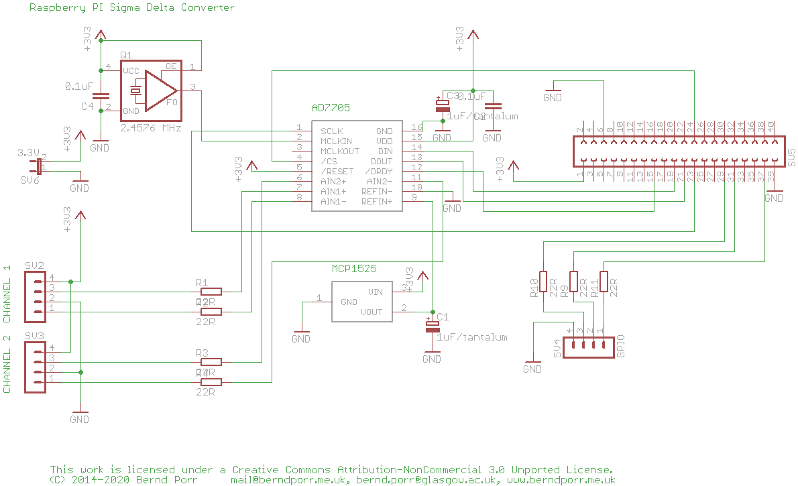

# Data acquisition with the AD7705 on the raspberry PI!

The AD7705 is a two channel sigma delta converter which has
differential inputs, a PGA and programmable data rates. It's
perfect for slowly changing inputs such as pressure, temperature,
heart rate etc.

This repo offers the class `AD7705Comm` which does all the low level
communications with the AD7705. The user just need to register a
callback handler which then returns the samples in realtime.

The class uses the DRDY of the AD7705 connected to Port 22 and
waits for a falling edge on this port to read
the data. This is done via interrupts / poll
so that the ADC process sleeps until new data becomes
available.

Further down I demonstrate how to use UDP to transmit the data to a web
page via PHP, JSON packets and client-side javascript!

## Hardware design

The design files (for EAGLE) are in the subdirectory "pcb".



## Building:

To build:

    cmake .

    make

## Install

    sudo make install

## Usage example

In the subdir example is a simple application which prints the ADC data to the screen.

    cd example
    sudo ./ad7705_printer

## General usage

The online doc is here: http://berndporr.github.io/rpi_AD7705_daq/

### Callback handler

```
class AD7705printSampleCallback : public AD7705callback {
	virtual void hasSample(float v) {
		// process your sample here
	}
};
```

### Main program

Instantiate the AD7705 class and the callback handler:
```
	AD7705Comm ad7705comm;
	AD7705printSampleCallback ad7705printSampleCallback;
	ad7705comm.setCallback(&ad7705printSampleCallback);
```

Start the data acquisition:
```
	ad7705comm.start(AD7705Comm::SAMPLING_RATE_50HZ);
```
once `start` has been called the data will be arriving.

Stop the data acquisition:
```
	ad7705comm.stop();
```

## Author: Bernd Porr

   - bernd.porr@glasgow.ac.uk
   - mail@berndporr.me.uk
   - www.berndporr.me.uk
